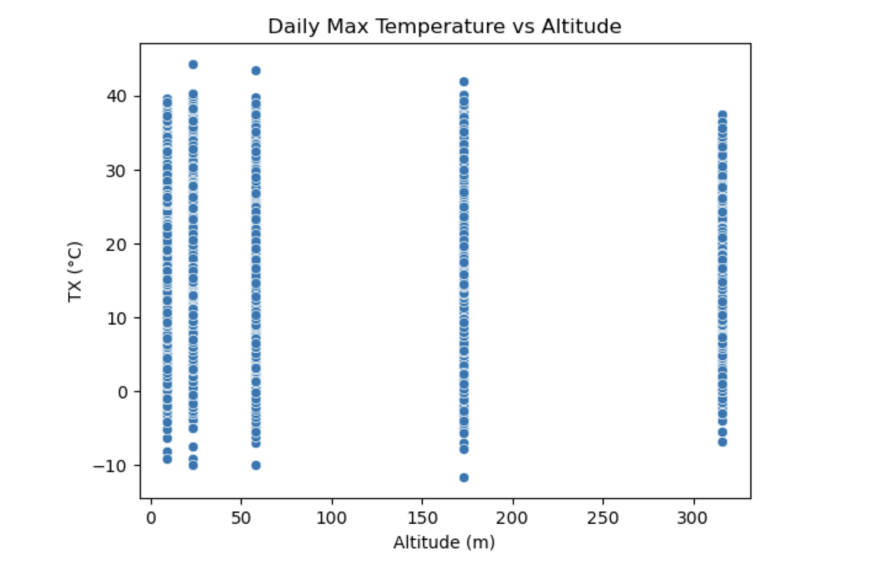

<<<<<<< HEAD
# Extreme-Temperature-Analysis
Write<b> By Mohammad Reza Nilchiyan</b>

Predicting Dangerous Heat Conditions in France 🇫🇷

The project focuses on extreme temperature behavior rather than averages, using surface station data from Météo-France. 
Wet-bulb temperature is derived from temperature and humidity variables. 
Extreme value statistics and machine learning models are used to assess regional vulnerability and future trends.

provided with historical meteorological data collected from surface weather stations operated by Météo-France, covering several decades and multiple stations per city.
The dataset includes daily measurements such as:

- Daily maximum temperature (TX)
- Daily minimum temperature (TN)
- Station location (latitude, longitude, altitude)
- Station identifiers and names

# Project Overview
working on a climate-risk and environmental analysis project.
When Do Temperatures Become Dangerous for Humans in France?
What is this project trying to answer?
This project investigates when, where, and how often temperatures in France reach dangerous or potentially unlivable levels for humans, now and in the future.
Instead of focusing on average temperatures, the project specifically targets extreme heat events, which are the true drivers of:
heat-related mortality,
crop failure,
power and infrastructure shutdowns.
The goal is to build an early-warning style predictor based on observed climate extremes.

### The central question of this project is:

 How do extreme temperatures behave over time and across locations, and what does this imply for regional vulnerability and future climate risk?

## Other Core Research Questions ❓
 - When do temperatures become dangerous for human survival?
 - How often do extreme heat events occur today?
 - How intense are these events, and are they becoming more frequent?
 - What is the probability of rare but catastrophic heat events (e.g. a “20-year heat event”)?

## Why Not Use Average Temperature?
*Average temperature* is a poor indicator of human risk.
- Mean temperature smooths out dangerous events  ❌ 
- Extreme temperature captures lethal conditions ✅
  
Deaths, crop loss, infrastructure failures, and blackouts occur during rare extremes, not during “average” days.
Therefore, this project focuses on the tails of the temperature distribution, not its center.

# What Data Is Used?
This project focuses on understanding extreme temperature behavior in French cities, rather than simple averages. To achieve this, we use surface meteorological station data measured at approximately 2 meters above the ground — the standard for capturing conditions that directly affect humans. Surface station measurements are critical because they reflect temperatures experienced in daily life, unlike upper-atmosphere readings, which are less relevant for local heat exposure and risk assessment.
From a Machine Learning and Data Science perspective, one of the biggest challenges is knowing where to start when confronted with a dataset. At first glance, it can feel overwhelming. We may not immediately understand:

- What each variable represents
- Which questions the dataset can help answer
- How to identify potential biases or gaps in coverage

*In this project* , we follow a structured approach to address these challenges:
1. Understanding the dataset and its context
- Focus on daily temperature data collected from five selected stations per city
- Examine station locations, altitude, and coverage periods
  
2. Developing essential data handling and analysis reflexes
- Explore daily maximum (TX) and minimum (TN) temperatures
- Identify missing values, inconsistencies, and biases
- Learn how temperature varies over time and across stations
  
3. Producing relevant visualizations with commentary and validation
- Use histograms, scatter plots, boxplots, and heatmaps to explore distributions and relationships
- Comment on observed patterns and validate them statistically or through data manipulation


# Dataset
Données climatologiques de base – quotidiennes (Météo-France)
Daily, quality-controlled surface observations from meteorological stations across metropolitan France and overseas territories.
Key characteristics
-Temporal resolution: daily
-Spatial resolution: station-based
-Time span: typically 1980 → 2023
-Data quality: validated and flagged by Météo-France

*Main source:*
Données climatologiques de base – quotidiennes (data.gouv.fr)
[Visit Météo-France website](https://donneespubliques.meteofrance.fr) and 

[Visit Météo-France website](https://www.data.gouv.fr/datasets/donnees-climatologiques-de-base-quotidiennes-stations-complementaires?utm_source=chatgpt.com) 
search for :: quot_departement_XX 

- Temperature: Q descriptif_champs_RR-T-Vent.csv
- Humidity: Q descriptif_champs_RR-T-Vent.cs
XX =
1. Paris → 75 : quot_departement_75
2. Lyon → 69:  quot_departement_69
3. Bordeaux → 33: quot_departement_33
4. Marseille → 13: quot_departement_13

# Key Variables
🌡️ **TX** — Daily Maximum Temperature (Core Variable)

- Definition: highest temperature recorded each day

- Unit: °C × 10 (e.g. TX = 354 → 35.4 °C)

Why important: defines the worst daily thermal stress on humans
------------------------------------------------------------------------------------

❄️ **TN** — Daily Minimum Temperature

- Nighttime minimum temperature

- High TN prevents nighttime recovery

- TX + TN together characterize heat waves
------------------------------------------------------------------------------------

🌍 **LAT, LON, ALTI**

- Geographic position and altitude

- Altitude strongly affects temperature extremes

- Must be controlled for bias and spatial heterogeneity
------------------------------------------------------------------------------------

# What Data Is Actually Extracted?

From the Météo-France catalogue, the project uses:

- Daily surface observations
  
- Station-based data
  
Variables:
TX (daily max temperature)
TN (daily min temperature)
Humidity or dew point
Date, station ID, location, altitude
Stations are aggregated into regions (NW, NE, SW, SE France).


# Data Exploration
This step answers *“What is inside the data?”*
- Check data size, structure, and variables
- Identify missing values and outliers
- Use summary statistics and visualizations
- Understand relationships between variables

## Why Wet-Bulb Temperature?
# What is Wet-Bulb Temperature (Tw)?
Wet-bulb temperature combines:

- air temperature

- humidity (or dew point)

It measures how effectively the human body can cool itself through sweating.

*Why is it critical?*

At high humidity, sweat does not evaporate efficiently.
When Tw ≈ 35 °C, the human body can no longer regulate its temperature.

📌 At this threshold:
even healthy people
in the shade
with water
without physical activity
can die within a few hours.
This is a physiological limit, not a theoretical model.

# Important

Wet-bulb temperature is not directly measured
It is computed from temperature and humidity variables

--> This demonstrates both data processing skills and domain knowledge

# What Does “Extreme Value Analysis” Mean Here?

This project analyzes rare but dangerous events, not typical days.

*Intuition (no math)*
Imagine all daily temperatures in a year:

- Most days are safe and moderate

- A few days are extremely hot

Those rare days lie in the right tail of the distribution.
This is where:

- heat stroke

- wet-bulb threshold exceedance

- infrastructure failure
actually occur.

# 📈 Average Yearly Maximum Temperature (TX) — Marseille (1995–2023)

This figure illustrates the evolution of the average yearly daily maximum temperature (TX) in Marseille between 1995 and 2023. Each point corresponds to the mean of all daily maximum temperatures recorded within a given year, while the connecting line highlights the temporal progression. Visually, the plot reveals a clear long-term upward trend in average maximum temperatures. During the early period (approximately 1995–2005), yearly averages generally range between 19.5°C and 20.5°C. In contrast, more recent years (2015–2023) frequently exceed 21°C, with several years reaching or surpassing 22°C. Although noticeable year-to-year variability is present, the overall pattern indicates a progressive warming of the local climate, particularly pronounced after 2010.

This increase in baseline temperature is a key contextual element for extreme temperature analysis. As average maximum temperatures rise, the probability, frequency, and intensity of extreme heat events also increase. Consequently, understanding this long-term trend is essential before focusing on extremes, thresholds, and impacts, which are central objectives of this project.


# Monthly Temperature Patterns Across Stations

This figure shows the monthly mean of daily maximum temperature (TX) for five surface meteorological stations in the Marseille area. All stations exhibit a clear and consistent seasonal pattern, with lower temperatures in winter and peak values during the summer months (June–August), confirming the climatological coherence of the dataset. Differences in temperature levels between stations reflect local geographic effects such as altitude and location, highlighting spatial heterogeneity that is relevant for the analysis of extreme heat risk. This exploratory analysis validates data quality and provides a foundation for studying temperature extremes and their spatial drivers.

### Station-to-station differences

## Station-to-station per Months

Some stations (e.g. Marignane, Salon-de-Provence) consistently contribute higher TX
Others (e.g. Aix-en-Provence) are slightly cooler

This reflects geographical effects:
- Altitude (ALTI)
- Distance to sea
- Urban vs rural exposure


## What are we looking for in this project here?
 project focus is:
- Understanding temperature behavior and extreme heat risk
  
The above figure helps answer three core questions:

1️⃣ Is the data climatologically coherent?
-  Yes — strong seasonality and realistic temperature ranges

2️⃣ Are stations comparable?
-  Yes — same pattern, different magnitudes

3️⃣ Where might extreme heat risk be higher?
- Summer months
- Stations with consistently higher TX

Lowest TX values:
Winter months (December–February)

Highest TX values:
Summer months (June–August), peaking in July–August

## Interpretation for all cities 
Annual summer mean temperatures (June–July–August) display a clear and consistent warming trend across all cities between 1950 and 2023. Prior to the 1980s, summer averages were typically within the range of 22–25 °C, whereas temperatures exceeding 26–30 °C become increasingly frequent after 2000. This pattern indicates a structural shift toward hotter summers rather than short-term variability.

Several extreme summers, notably 1976, 2003, 2018, 2019, and 2022, appear simultaneously across multiple cities, suggesting large-scale climatic drivers. The 2003 heatwave stands out as an exceptional nationwide event, while 2022 matches or exceeds 2019 in severity in several locations.
Marseille generally records the highest summer mean temperatures due to its Mediterranean climate, while Paris and Lyon exhibit sharp temperature peaks during heatwaves, reflecting urban heat amplification effects. Overall, the rising frequency and intensity of extreme summers underscore the importance of heatwave-focused early warning systems and targeted adaptation strategies.


The stacked bars represent the annual number of extreme heat days (TX ≥ 35 °C). A clear upward trend is observed over time, particularly after the 1990s, highlighting a growing exposure to dangerous heat conditions. Several years, notably 1976, 2003, 2018, 2019, and 2022, emerge as major extreme summer events at the national scale.
Marseille consistently records the highest number of extreme heat days, reflecting the influence of its Mediterranean climate and coastal heat persistence. While other cities experience pronounced peaks mainly during exceptional heatwave years, Marseille shows both higher frequency and intensity of extreme temperatures, making it a key location for assessing heat-related risks and long-term climate vulnerability.


## Station-to-station per day
- ALTI = fixed
- TX = variable
- This means:
❌ This plot does NOT show a smooth relationship
❌ You cannot infer a slope from raw daily data




SO, cannot say
- “Temperature increases linearly with altitude” ❌
- “Altitude explains daily TX variation” ❌

## Interpretation
- Daily maximum temperature shows large variability at each altitude, while altitude itself is a fixed station characteristic. The vertical clustering reflects multiple daily observations per station rather than a continuous altitude gradient.


## Search term for the temp & wind data
Combines two DataFrames (df_tx and df_wind) by matching rows on the "date" column.

  
# Identifying the ML Problem Type
here is question to answer : 
- What Are We Trying to Predict?
  
=======
# 🌡️ Extreme Heat Events in France: Predictive Modeling
**An Early Warning System for Dangerous Heat Conditions (1990–2025)**

 [](https://extremeheatevents-france.streamlit.app)

## 🎯 Research Question
**When are people exposed to dangerous heat conditions in France?**

The objective of this project is to build a predictive that serves as an early heat warning system. We focus on **extreme daily temperatures**, specifically the daily maximum temperature (**TX**), to identify patterns and predict events early enough to act. 

> **Scientific Definition:** In this study, a heatwave is defined as a period where the daily maximum temperature exceeds the 95th percentile (0.95 quantile) of the local historical climate for at least three consecutive days.

---

## 🚀 Interactive Web App
Explore our models and climate analysis in the live Streamlit application.

🔗 **[Live Demo: Extreme Heat Events App](https://extremeheatevents-france.streamlit.app)**

### Suggested Walkthrough
1. **Introduction & Motivation:** Context on global warming trends in France, including raw data analysis and visualizations of the increasing frequency of heatwaves.
2. **Data Explanation & First Model:** View the initial approach using Météo-France daily data and Gradient Boosting.
3. **Improvements & Final Model:** Explore the optimized **XGBoost** model trained on **Copernicus** data (1990–2025).
4. **Conclusion & Next Steps:** Summary of key findings and our technical roadmap.

---

## 🛠️ Project Evolution & Methodology

### Study Regions
We analyzed four French départements representing diverse climate zones:
* **Paris (75)**, **Lyon (69)**, **Bordeaux (33)**, and **Marseille (13)**.

### Data Sources & Technical Stack
The project evolved through two main stages:

* **First modeling phase (daily data):** Tmax and wind data (from five meteorological stations per city). Used Météo-France daily climatological data (*Données climatologiques de base – quotidiennes*) via [data.gouv.fr](https://www.data.gouv.fr/).
* **Second modeling phase:** Temperature at various altitudes, air pressure, shortwave radiation, soil moisture, and wind data (reanalysis). Climate data from the **[Copernicus Climate Data Store](https://cds.climate.copernicus.eu/)** (ERA5).
* **Predictive Modeling:** Transitioned from Gradient Boosting to an optimized **XGBoost** architecture, incorporating atmospheric features like wind stagnation and persistence signals.

> **Note on Data Integrity:** To ensure a robust predictive system and avoid **data leakage**, all temperature features (including 2m temperature and temperatures at various upper-atmospheric levels) are used exclusively in a **lagged approach**. This ensures the model only learns from historical data to predict future events.

### 🛰️ Data Acquisition (Copernicus API)
The repository includes `copernicus_api_script.py`, which allows users to programmatically fetch updated climate data directly from the Copernicus Climate Data Store for further analysis or model retraining.

---

## 💡 Key Insights & Business Value
* **Regionality Matters:** Paris shows stronger urban amplification, while Marseille is shaped by coastal effects.
* **Feature Engineering:** Adding atmospheric stagnation and 48-hour rolling persistence features significantly made the model more robust.
* **Value Proposition:** The system is **lightweight**, runs on standard hardware, and is regionally customizable, providing a foundation for early warning systems relevant to public health services and urban planning.

---

## 🔮 Roadmap & Next Steps
To evolve this into a production-ready system:
* **Sequence Modeling:** Benchmark **LSTM or Transformer** models to evaluate longer temporal dependencies.
* **Spatial Expansion:** Extend coverage to Spain, Italy, and Germany.
* **Climate-Adaptive Thresholds:** Use rolling percentiles to account for long-term climate trends.
* **Probabilistic Outputs:** Generate calibrated probabilities for better stakeholder risk assessment.

---

## 💻 Installation & Usage

### Local Setup
1.  **Clone the repository:**
    ```bash
    git clone <repository-url>
    cd <repository-folder>
    ```

2.  **Install dependencies:**
    ```bash
    pip install -r requirements.txt
    ```

3.  **Run the Streamlit App:**
    ```bash
    streamlit run streamlit/streamlit_main.py
    ```

---
*Note: This project was developed as part of a Data Science certification ([Liora](https://liora.io/)).*
>>>>>>> team/extreme_heat_eduard
